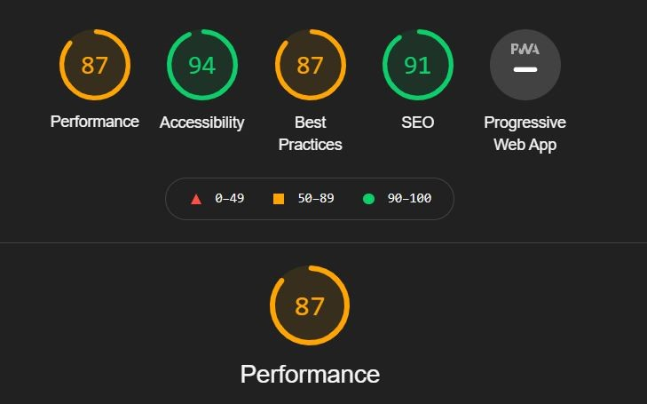

## CicekSepeti & Patika.dev React Bootcamp Graduation Project

This project created by using **ReactJS** for graduation project given from **CicekSepeti-Patika.dev React Bootcamp**

## Installation and Setup

Clone down this repo. You'll need `node` and `npm` or `yarn` package manager installed globally on your machine.

Installation:

`npm install` to install all dependencies

To start the server:

`npm start` or `yarn start` to start the local server

To visit the App:

`localhost:3000/login`

## Functionality

The example application is a sample e-commerce site called "Ikinci El Project". It uses a custom API for all requests, including authentication.

**General functionality:**

- Authenticate users via JWT (login/register pages)
- GET and display lists of products by category
- Display product detail information
- Purchase or offer to the product
- Create a product

 

- Home page (URL: /#/ )
  - List of products
  - List of products pulled from specific category
- Sign in/Sign up pages (URL: /#/login, /#/register)
  - Use JWT (store the token in localStorage)
- Product detail page (URL: /#/products/{productID})
- Account page to lists of products that received and given then controlled them by accept or reject functions (URL: /#/account)
- Add Product page (URL: /#/add-product)
  - Create product

## Performance Metrics

**Tools that I used:**

- `redux`, `redux-thunk` for state management
- `react-router`
- `react-toastify`
- `styled-components` and `node-sass`
